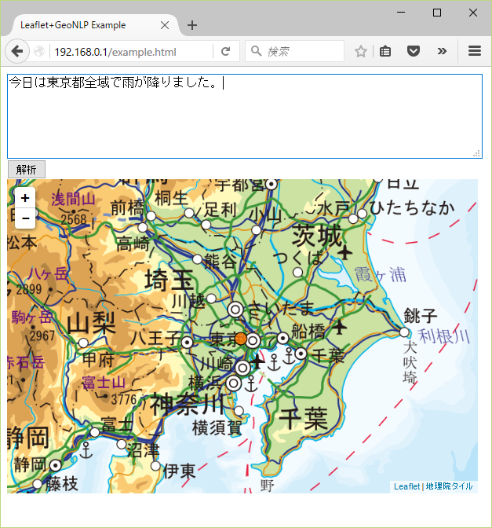

.. _software_cgi:

====================================================
CGI プログラム
====================================================

GeoNLP ソフトウェアに含まれる CGI プログラムについて説明します。

.. _cmd_geonlp_cgi:

geonlp_cgi
================================================

:ref:`software_install_install` を実行すると、インストールディレクトリに geonlp_cgi という実行可能ファイルが生成されます。このプログラムを Apache の CGI ディレクトリに配置すると、 CGI プログラムとして機能します。

.. sourcecode:: bash

  % sudo cp /usr/local/bin/geonlp_cgi /var/www/cgi-bin/

CGI ディレクトリは Apache の設定によって異なりますので、配置先はウェブサーバの管理者に確認してください。

使い方
====================================================

設置した geonlp_cgi に HTTP で JSON-RPC リクエストを POST すると、テキストを処理してレスポンスが返されます。利用可能なメソッドや書式については :ref:`webapi` を参照してください。

使用サンプル
====================================================

CGI プログラムを利用した簡単な使用サンプルを示します。

このサンプルは、テキストボックスに入力された文章を、ローカルサーバの geonlp_cgi プログラムに渡して解析し、結果の GeoJSON を `Leaflet <http://leafletjs.com>`_ で地図上に描画します。

HTML ファイルを :download:`ここからダウンロード <example.html.txt>` して、ウェブサーバ上に配置してください。たとえば /var/www/html/example.html という名前で配置します。

その後、ウェブブラウザで配置したページにアクセスすると、次のような画面が表示されます。テキストエリアに地名や住所を含むテキストを入力し、「解析」ボタンを押すと、抽出された地名に対応する場所にオレンジ色の丸印が表示されます。

図では「東京都」に対応する点（都庁の位置）にマークがついています。今のところ GeoNLP は点の情報しか持っていないため、「東京都」に対応する「領域」ではなく「代表点」の座標が返されることに注意してください。

このサンプルの HTML コードは以下の通りです。

.. literalinclude:: example.html.txt
   :language: html

