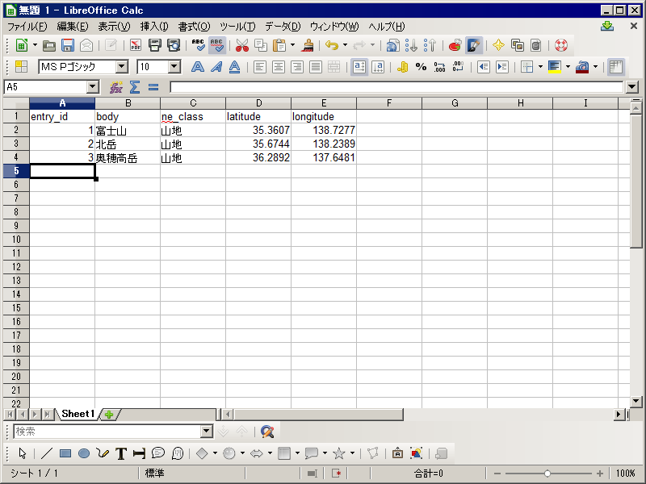
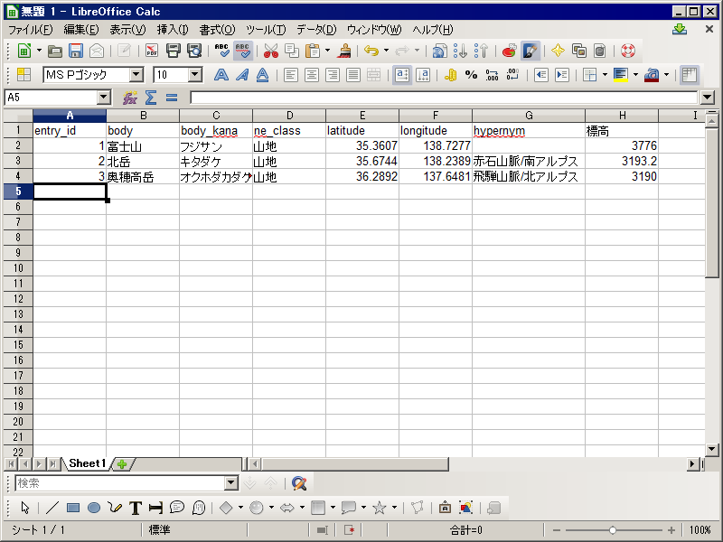

.. _tutorial_create_dictionary:

辞書データの入力
================

前頁の例のような項目をカンマ（，)で区切ったデータ表現は CSV (Comma Separated Values）と呼ばれ、Microsoft Excel などの表計算ソフトで作った表データを交換する時に利用されています。

辞書データを簡単に入力するには、使い慣れた表計算ソフトでデータを入力し、「名前を付けて保存 (Save As)」を選んで「CSV形式」で保存します。

辞書データの規則
----------------

辞書データにはいくつかの規則があります。

たとえば、1行目に項目名を書くこと、地名表記のカラムを示す項目名は「body」とすること、山を表すのに「山地」を利用することなどは規則です。

規則に従っていない辞書データは、アップロードした時にエラーになったり、検索しても見つからない原因になります。詳しくは :ref:`csv_format` を参照してください。

辞書データを作っていると、もっと多くの情報を辞書に登録したくなるかもしれません。たとえば山の辞書の場合、読み方や属する山系、山の標高なども書きたくなると思います。

GeoNLP の地名辞書では、読み方など一部の項目については、多くの地名辞書で利用されるので名称を統一しています。詳しくは :ref:`datamodel_geoword` を参照してください。

山の標高のように、他の地名辞書では使われない項目は、項目名を自由に決めて構いません。

