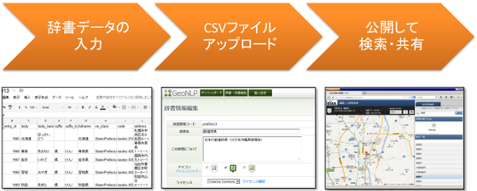

.. _tutorial_top:

地名解析辞書作成チュートリアル
==================================

ここでは地名解析辞書を作成し、ウェブで公開する手順を簡単に説明します。

地名解析辞書とは？
------------------

:ref:`geonlp_terms_dictionary` とは、地名の表記や読み、経度緯度、
その地名が表しているもの（山の名前、島の名前など）を集めた
地名のコレクションです。

GeoNLP では誰もが簡単に地名解析辞書を作れることをめざし、
表計算ソフト等で編集できるシンプルなフォーマットを採用しています。
たとえば「富士山」のエントリは次のように書くことができます。::

  entry_id,body,ne_class,latitude,longitude
  1,富士山,山地,35.3607,138.7277

これで「富士山」という表記の地名が存在し、この地名は「山地」を表すもので、
その緯度と経度は 35.3607, 138.7277 であることが表現できます。

また、作成した辞書を `GeoLOD サイト <https://geolod.ex.nii.ac.jp/>`_
にアップロードすると、辞書を共有したり地名を登録することができます。

