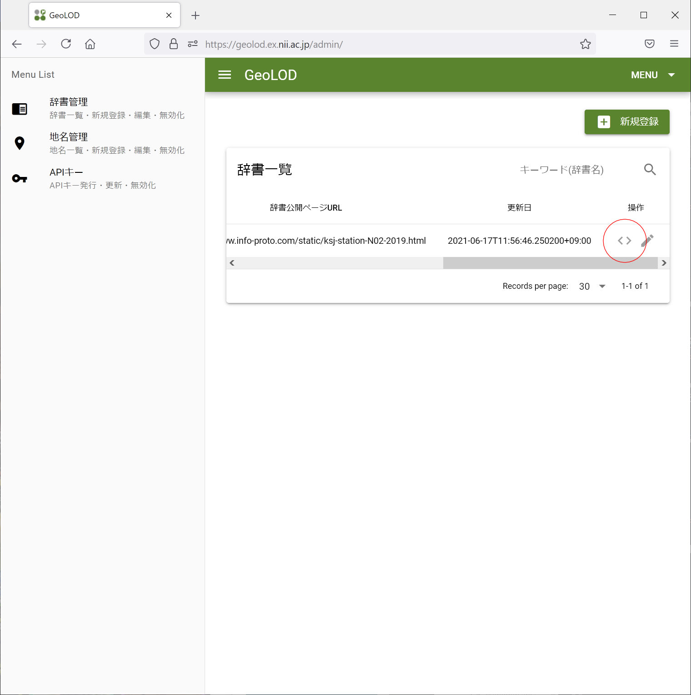

.. _tutorial_share_dictionary:

辞書の検索・共有
====================================
辞書を登録すると、辞書に含まれている地名が
`GeoLOD サイト <https://geolod.ex.nii.ac.jp>`_ で検索できるようになります。

地名辞書に登録した地名が検索できること、位置が正しいことなどを確認してください。

.. image:: images/fujisan.png

以上でチュートリアルは完了です。

まとめ
=====================================

GeoNLP の地名解析辞書は、簡単に作れることと共有しやすいことを目的にしているため、
他の地名サービスに比べてとてもシンプルです。

チュートリアルでは触れなかったデータ項目を利用することで、
より複雑な地名辞書を作ることもできます。
オリジナルの項目を任意に追加することもできますので、
ぜひ面白い地名辞書を作って公開してください。

辞書データの作り方についてより詳しく知りたい方は、 :ref:`csv_format` を参照してください。

PyGeoNLP との連携
=================

GeoNLP は、単に地名解析辞書を共有するだけのサービスではありません。
公開・共有された辞書を利用して、
テキストから地名を抽出する機能を python ライブラリとして提供しています。

地名抽出機能を利用したアプリケーションを開発したい場合は、
:ref:`pygeonlp` から開発に必要な情報を得ることができます。

ここでは制作した地名解析辞書を PyGeoNLP で利用する方法を大まかに説明します。

PyGeoNLP での地名解析辞書の利用方法
-----------------------------------

制作した地名解析辞書を PyGeoNLP で利用したい場合、 CSV 形式の辞書ファイルの他に
JSON 形式のメタデータが必要です。

メタデータはテキストエディタで作成しても構いませんが、
GeoLOD サイトにメタデータを作成する機能があります。

メタデータを作成したい辞書の右側に表示されている ``< >`` アイコンを
クリックすると、ウィンドウが開きメタデータが作成されます。
ウィンドウ内のテキストのうち、 ```` の間の JSON 部分をクリップボードにコピーし、
適当なファイルに保存してください。

JSON ファイルなので拡張子は ``.json`` とするのが一般的です。

PyGeoNLP の ``addDictionaryFromFile(jsonfile, csvfile)`` 関数を利用し、
作成した CSV と JSON ファイルをデータベースに登録すれば、
地名解析辞書中の地名語を抽出することができるようになります。
地名解析辞書を公開せずに組織内などで利用したい場合には
この方法を用いてください。

ウェブサイト上で公開する場合、``<script type=...</script>`` 全体を
ウェブページの ``<meta>`` ヘッダに含めておくと、
`Google Dataset Search <https://datasetsearch.research.google.com/>`_ で
検索できるようになります。
Google Dataset Search で "geonlp city" を検索すると
`歴史的行政区域データセットβ版地名辞書 <https://geonlp.ex.nii.ac.jp/dictionary/geoshape-city/>`_ が見つかりますので、このページを参考にして
ウェブページを作成してください。

この形式のヘッダを持つページの URL を PyGeoNLP の
``addDictionaryFromWeb(url)`` 関数のパラメータに指定すれば、
CSV ファイルのダウンロードとデータベースへの登録を行うことができます。
より多くの人に地名解析辞書を使ってもらいたい場合には
こちらの方法でウェブ公開してください。

:ref:`tutorial_top` に戻ります。
