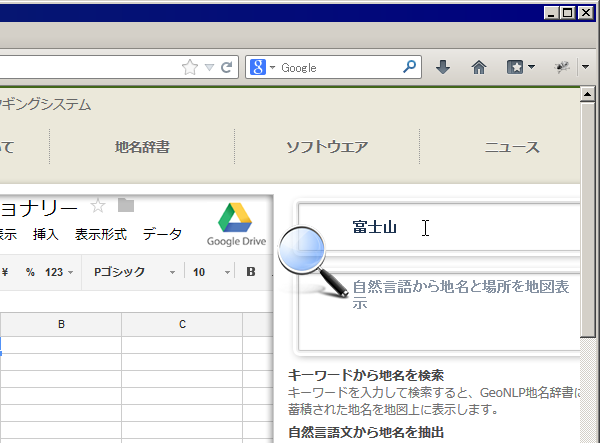
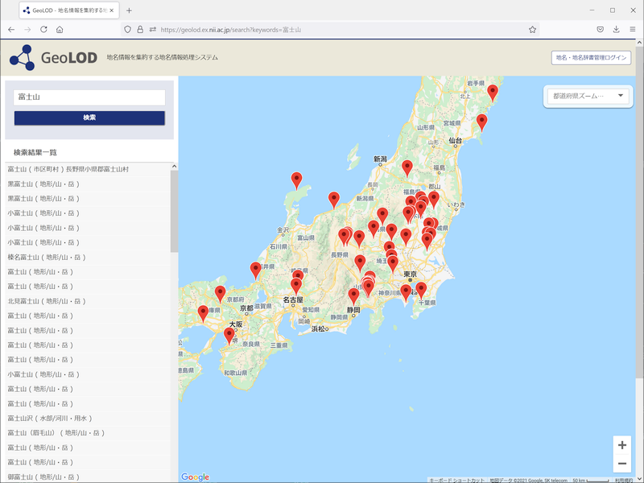

.. _tutorial_share_dictionary:

====================================
辞書の検索・共有
====================================
アップロードされたCSVファイルは、GeoNLP サーバの管理者が内容を確認し、問題が無いと判断した時点で公開されます。

公開されると「地名検索」ボックスから検索できるようになります。

地名辞書に登録した地名が検索できること、位置が正しいことなどを確認してください。

以上でチュートリアルは完了です。

まとめ
=====================================

GeoNLP の地名辞書は、簡単に作れることと共有しやすいことを目的にしているため、他の地名サービスに比べてとてもシンプルです。

チュートリアルでは触れなかったデータ項目を利用することで、より複雑な地名辞書を作ることもできます。オリジナルの項目を任意に追加することもできますので、ぜひ面白い地名辞書を作って公開してください。

辞書データの作り方についてより詳しく知りたい方は、 :ref:`csv_format` を参照してください。

次のステップ
=====================================

GeoNLP は、単に地名辞書を共有するだけのサービスではありません。公開・共有された辞書を利用して、テキストから地名を抽出する機能を Web サービスとして提供しています。

地名抽出機能を使うとどんなことができるのか見てみたいという場合は、 :ref:`developers_showcase` をご覧ください。

地名抽出機能を試してみたい場合は、 `GeoNLP 地名ウェブサービス <https://dias.ex.nii.ac.jp/geonlp>`_ の「GeoNLP地名解析」機能をご利用ください。お好きなテキストを入力すると、そこに含まれる地名を抽出して地図上に表示します。

地名抽出機能を利用したアプリケーションを開発したい場合は、 :ref:`system_developers_index` から開発に必要な情報を得ることができます。

:ref:`tutorial_top` に戻ります。
