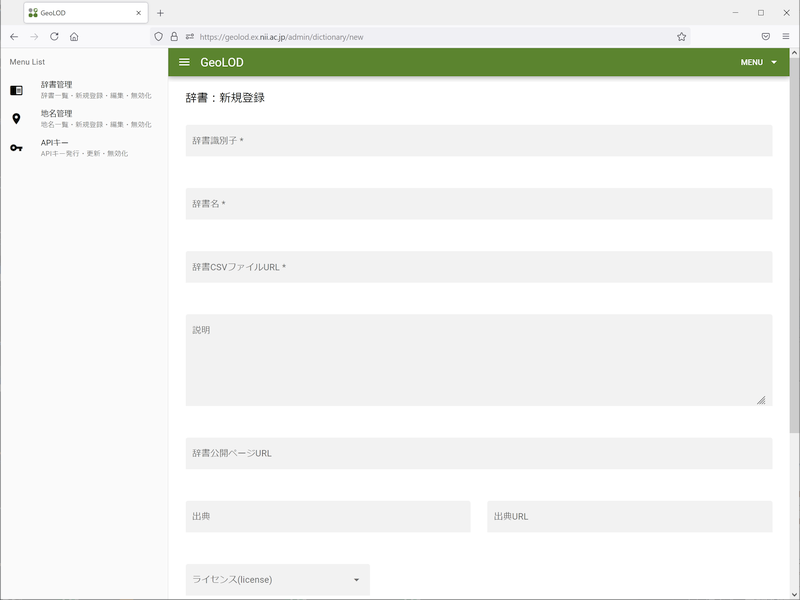

.. _tutorial_upload_dictionary:

地名解析辞書の公開
==================
CSV 形式の辞書データができたら GeoLOD サイトに登録することで公開し、
他のユーザと共有できます。

CSV データのアップロード
------------------------
まず、作成した CSV ファイルをウェブ上に置いてください。

自由にファイルを置けるウェブサーバが無い場合は、
`Google Drive <https://drive.google.com/>`_ などのクラウドストレージに置き、
誰でもアクセスできるようにしてください。

辞書の新規登録
--------------
初回は GeoLOD サイトにユーザ登録する必要があります。
ブラウザで `GeoLOD サイト <https://geolod.ex.nii.ac.jp/>`_ にアクセスし、
右上の「地名・地名辞書管理ログイン」ボタンを押します。

「GeoNLP管理画面にログイン」という画面が表示されますので、
メール、Googleアカウント、Twitterアカウント、Facebookアカウントの中から
好きなものを選び、GeoLOD アカウントとして登録してください。

画面左側のメニューから「辞書管理」を選択し、右上の「新規登録」
ボタンを押してください。

「辞書：新規登録」画面が表示されるので、以下の項目を入力します。

*辞書識別子*
  登録する辞書を簡潔に表す「識別子」を指定します。同じ識別子を持つ辞書は
  1つだけしか登録できません。他のユーザが使っている識別子も登録できませんので、
  一般的過ぎる名称（たとえば ``mountain``）は避けてください。後で変更もできません。

  この辞書の詳細情報を表示する際の URL などにも使われますので、
  コンピューターで管理しやすいよう、全て半角文字で、英数字、ハイフン（「-」）、
  アンダーバー（「_」）を利用するようにしてください。

  辞書データは更新できますので、特に理由がなければバージョン番号を付ける必要は
  ありません。

  - 例： ``geoshape-city``

*辞書名*
  登録する辞書の名前です。辞書一覧などに表示されます。後で変更もできます。
  日本語も使えます。辞書の元となったデータの調査年月を含めておくのも有用です。

*辞書CSVファイルURL*
  アップロードした CSV を直接ダウンロードできる URL を指定します。

  Google Drive などを利用している場合、表示用リンクとダウンロード用リンクが
  異なる場合がありますので注意してください。

*説明*
  登録する辞書の簡単な説明です。他の人が読んでも分かるように、
  何に関する地名を登録しているか、情報源のデータをどのように加工したか、
  どのような基準で選択したかなどを記載します。

  独自に拡張した項目については、見ただけで意味が分からない場合には、
  この項目内で説明してください。

*辞書公開ページURL*
  辞書を公開するウェブページの URL を指定します。

*出典*
  登録する辞書の元となったデータがある場合、書籍名やウェブサイト名などを記載します。
  転載やダウンロードしてデータを作成した場合は、元情報の著作権や利用許諾条件を
  侵害していないことをご確認ください。

  原著作者の表示義務があるデータを利用した場合にも、この項目に表示してください。

*出典URL*
  情報源のウェブページがある場合、ここに URL を記載してください。

*ライセンス*
  登録する辞書のライセンスとして適切なものを選びます。適当なライセンスが無ければ、
  ``All Rights Reserved`` を選択してください。

*作成者*
  このデータを作成したのが個人の場合は Person、組織の場合は Organization を
  選択してください。

*名前*
  このデータの作成者の個人名・組織名を入力してください。

*URL*
  個人または組織を代表する URL を入力してください。

*その他の識別子*
  このデータに DOI など他のドメインの識別子が付いている場合、ここに入力できます。

*別名（辞書名）*
  この辞書の別名を入力することができます。

「登録」ボタンを押すと、辞書CSVファイルURLから自動的に CSV のダウンロードと
データのチェックが行なわれます。

エラーがなければ、全ての地名に一意の geolod_id が付けられた CSV データが
ダウンロードされますので、ファイルに保存して元の CSV ファイルと置き換えてください。

