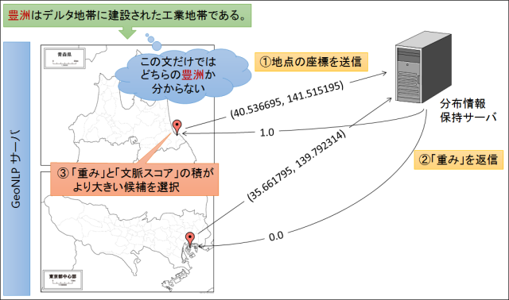

.. _dist_server:

================================================
分布情報保持サーバ
================================================

ここでは、同綴地名の解決に「分布情報保持サーバ」を利用する方法を説明します。
この機能は GeoNLP Software Version 1.1.0 以降で利用可能です。

分布情報保持サーバとは？
================================================

GeoNLP では、地名解析辞書を適切に選択すれば「どの地名を抽出するか」をある程度制御することができます。しかし同名（同綴）地名が同じ辞書に存在する場合にどちらが選択されるか（曖昧地名解決）は、前後に出現する他の地名語との関係を用いたシステム内部の計算による「文脈スコア」で決まり、外部からは制御できません。

たとえば「豊洲はデルタ地帯に建設された工業地帯である。」という文に含まれる「豊洲」という地名語は、「日本の大字」辞書に江東区と八戸市の2つが登録されており、どちらが選択されるかは前後の文章に依存します。しかし対象文書が「青森県に関する文章」であることが分かっているならば、その外部知識を与えることで「八戸市の豊洲」を選択するように制御できます。その外部知識を提供するサーバが「分布情報保持サーバ」です。

この機能の概要を図に示します。

分布情報保持サーバは、候補となる地名語の経緯度を受け取り、「どちらの地名語を選択するべきか」という情報を「位置に対する重み」という形で返します。たとえば青森県内の地名ならば1.0、県外ならば0.0を返すサーバを利用すれば、必ず青森県内の地名が選択されます。

.. _dist_server_request:

分布情報保持サーバへの問い合わせ
================================================

分布情報保持サーバを利用して地名解決を行うには、次のように :ref:`webapi_parse_option` として dist-server を指定します。

parse オプションの例
++++++++++++++++++++++++++++++++++++++++
.. code-block:: javascript

  {
    "method": "geonlp.parse",
    "params":
      [
        "豊洲はデルタ地帯に建設された工業地帯である。",
        {
          "geocoding":true,
          "threshold":0,
          "show-candidate":false,
          "dist-server":{
            "url":"http://www.info-proto.com/place/geonlp_dist.php",
            "method":"getAomoriWeight",
            "option":{"datetime":"201501011200"}
          }
        }
      ],
    "id": "1"
  }

url
++++++++++++++++++++++++++++++++++++++++

:name: URL
:type: string
:default: 必須
:例: "http://www.info-proto.com/place/geonlp_dist.php"

分布情報保持サーバのエンドポイント URL を指定します。この URL が指す場所に独自の分布情報保持サーバを実装してください。サーバ側の実装については :ref:`dist_server_implement` を参照してください。

method
++++++++++++++++++++++++++++++++++++++++

:name: Method
:type: string
:default: 必須
:例: "getAomoriWeight"

分布情報保持サーバ側でどの処理を実行するか（どの分布情報を返すか）を選択するために指定するメソッド名です。 `JSON-RPC <http://json-rpc.org/>`_ の method として利用されるため、省略できません。

option
++++++++++++++++++++++++++++++++++++++++

:name: Option
:type: 任意
:default: null
:例: {"datetime":"201501011200"}

分布情報保持サーバ側で実行される処理に、何らかのパラメータを渡したい場合に利用するオプションです。数値、文字列、配列、オブジェクトなど、JSON で記述できる値であれば何でも渡せます。

たとえば気温の時系列データを保持しているサーバに、時刻をオプションとして渡すといった使い方ができます。

.. _dist_server_implement:

分布情報保持サーバのサーバ側実装
================================================

分布情報保持サーバは `JSON-RPC <http://json-rpc.org/>`_ サーバとして実装します。 GeoNLP サーバからは次のフォーマットの JSON-RPC リクエストが送信されます。

:method: dist-server オプションの "method" 
:params: 第一パラメータに経緯度の配列、第二パラメータに dist-server オプションの "option" で指定された値
:id: 1から10000の間の整数値

JSON-RPC リクエストの例
++++++++++++++++++++++++++++++++++++++++
.. code-block:: javascript

  {
    "id": 9384,
    "method": "getAomoriWeight",
    "params": [
      [
        [ "35.661795", "139.792314" ],
        [ "40.536695", "141.515195" ]
      ],
      {
        "datetime": "201501011200"
      }
    ]
  }

このリクエストに含まれる経緯度の配列と同じ個数だけ、重みを数値の配列として result にセットして返します。 JSON-RPC の仕様に従い、エラーが発生しなかった場合には error に null をセットします。また id はリクエストの id と同じ値を返します。

:ref:`webapi_parse` の結果として返される地名語は、「GeoNLP 内部で計算したスコア」と「重み」の積が最大となるものが選ばれます。そのため重みとして 0 を返すとその地名語は選択されなくなります。1より大きい値を返しても問題ありませんが、オーバーフローを起こさないようあまり大きな値は返さないようにしてください。

JSON-RPC レスポンスの例
++++++++++++++++++++++++++++++++++++++++
.. code-block:: javascript

  {
    "result": [ 1, 0 ],
    "error": null,
    "id": 9384
  }

エラーが発生した場合には、やはり JSON-RPC の仕様に従い、result に null
を、 error にエラーの理由（文字列）をセットして返します。

.. code-block:: javascript

  {
    "result": null,
    "error": "Service temporary not available",
    "id": 9384
  }

PHP による分布情報保持サーバのサンプル
++++++++++++++++++++++++++++++++++++++++
:download:`ダウンロード <php/geonlp_dist.php.txt>`

PHP を利用した「分布情報保持サーバ」のサンプルコードを示します。
function execute() 内で method による分岐を行います。

getAomoriWeight の内部で、青森県のおおよその経緯度範囲の内外判定を行い、
0 または 1 をセットして返します。実際の分布情報保持サーバではこの部分で適切な計算を行ってください。

.. literalinclude:: php/geonlp_dist.php.txt
   :language: php
