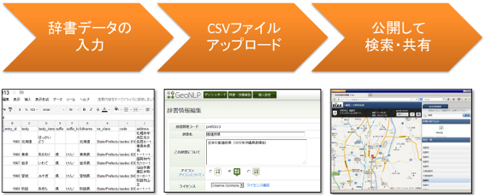

.. _tutorial_top:

==================================
地名辞書作成チュートリアル
==================================

ここでは地名辞書を作成し、サーバにアップロードし、公開する手順を簡単に説明します。

地名辞書とは？
==================================
地名辞書とは、地名の表記や読み、経度緯度、その地名が表しているもの（山の名前、島の名前など）を集めた地名のコレクションです。

GeoNLP では、誰もが簡単に地名辞書を作れることをめざし、表計算ソフト等で編集できるシンプルなフォーマットを採用しています。たとえば「富士山」は次のように書きます。::

  entry_id,body,ne_class,latitude,longitude
  1,富士山,山地,35.3607,138.7277

これで「富士山」という表記の地名が存在し、この地名は「山地」を表すもので、その緯度と経度は 35.3607, 138.7277 であることが表現できます。

次のステップ
==================================

:ref:`tutorial_create_dictionary` に続きます。
