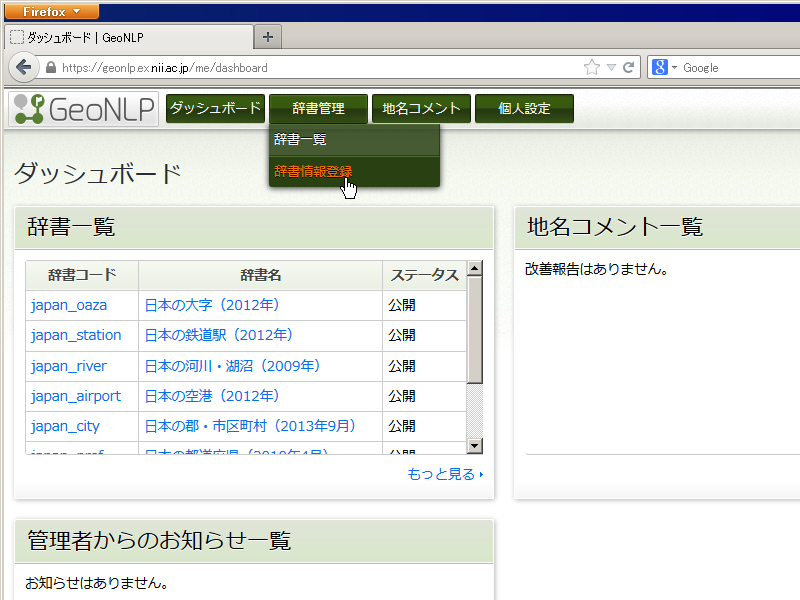
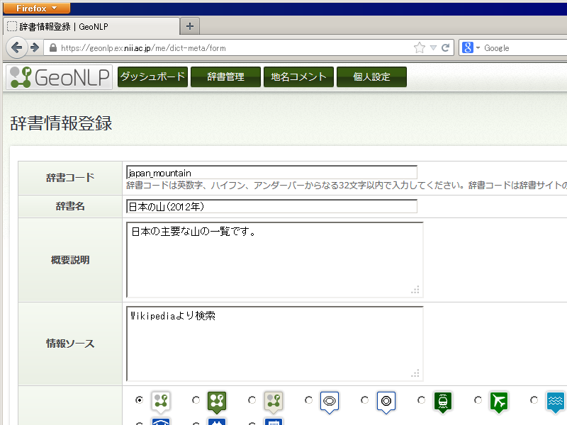
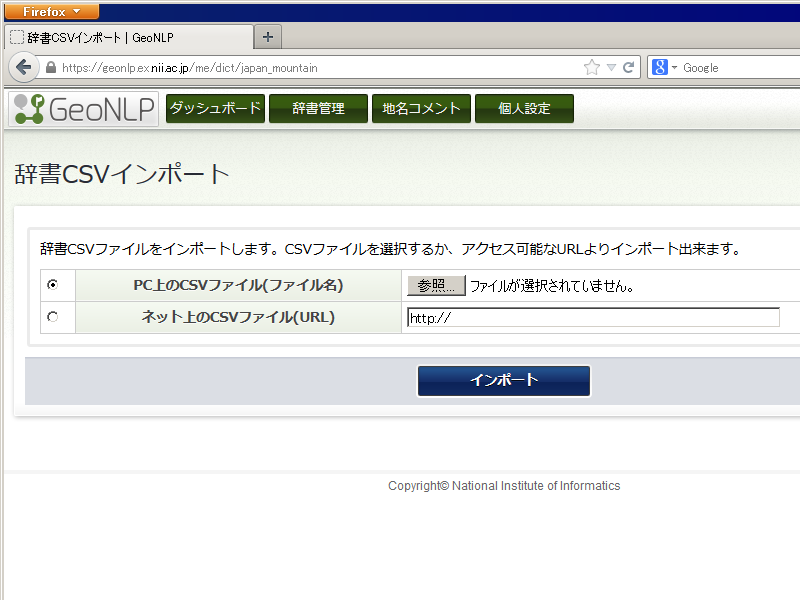

.. _tutorial_upload_dictionary:

==================================
CSVファイルのアップロード
==================================
CSV 形式の辞書データができたら GeoNLP サーバにアップロードします。
（先に GeoNLP サーバにユーザ登録しておく必要があります）

ログイン
==================================
まずブラウザで `GeoNLPサーバ <https://geonlp.ex.nii.ac.jp/>`_ にアクセスし、
ログインします。「管理画面」ボタンを押してダッシュボードを開きます。

メニューから辞書管理＞辞書情報登録と進みます。

辞書情報登録画面
==================================

以下の項目を入力します。

*辞書コード*
  登録する辞書を簡潔に表す「コード」を指定します。同じコードを持つ辞書はユーザ1人につき1つだけしか登録できません（他のユーザが同じコードを使っていても構いません）。後で変更もできません。

  この辞書の詳細情報を表示する際の URL や、辞書をダウンロードする時のファイル名にも使われますので、コンピューターで管理しやすいよう、利用できる文字は全て半角文字で、英数字、ハイフン（「-」）、アンダーバー（「_」）だけです。

*辞書名*
  登録する辞書の名前です。辞書一覧などに表示されます。後で変更もできます。日本語も使えます。公式辞書では、辞書の元となったデータの調査年月も辞書名に含めています。

*概要説明*
  登録する辞書の簡単な説明です。他の人が読んでも分かるように、何に関する地名を登録しているか、情報源のデータをどのように加工したか、どのような基準で選択したかなどを記載します。

  自由に拡張した項目については、見ただけで意味が分からない場合には、この項目内で説明してください。

*情報ソース*
  登録する辞書の元となったデータがある場合、書籍名やウェブサイト名などを記載します。転載やダウンロードしてデータを作成した場合は、元情報の著作権や利用許諾条件を侵害していないことをご確認の上、アップロードしてください。

  ウェブページがある場合、 URL も記載してください。原著作者の表示義務があるデータを利用した場合にも、この項目に表示してください。

*アイコン*
  辞書を一覧表示したり地図表示する際に利用されるアイコンを選択してください。適当なアイコンが無ければ、「アイコンを登録する」を選べばオリジナルアイコンを登録することもできます。

*ライセンス*
  登録する辞書のライセンスとして適切なものを選びます。適当なライセンスが無ければ、「ライセンスを登録する」を選び、オリジナルライセンス条件を登録することもできます。

「登録」ボタンを押すと登録完了ですが、ここでは辞書の名前などを決めただけで、まだ辞書のデータそのものは登録していません。続いて画面右下部分の「辞書CSV登録・更新」ボタンを押してCSVファイルのアップロードを行います。

辞書CSVインポート画面
==================================

「辞書CSV登録・更新」ボタンを押すと、辞書CSVインポート画面が表示されます。

PC上で作成したCSVファイルをアップロードしたい場合は、「PC上のCSVファイル(ファイル名)」を選択し、「参照」ボタンを押して、保存したCSVファイルを選択します。

インターネット上でアクセスできる場所（DropBox や Google ドライブなどのクラウドストレージ）にCSVファイルがある場合は、「ネット上のCSVファイル(URL)」を選択し、右側の入力ボックスにその URL を入力してください。ただし、アクセスにパスワードが必要な場合は利用できません。

「インポート」ボタンを押すとファイルがサーバに読み込まれます。ファイルフォーマットに問題があるとエラーが表示されますので、該当する箇所を修正してから、再度アップロードしてください。

以上でCSVファイルのアップロード完了です。

次のステップ
==================================
:ref:`tutorial_share_dictionary` に続きます。
